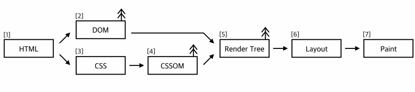
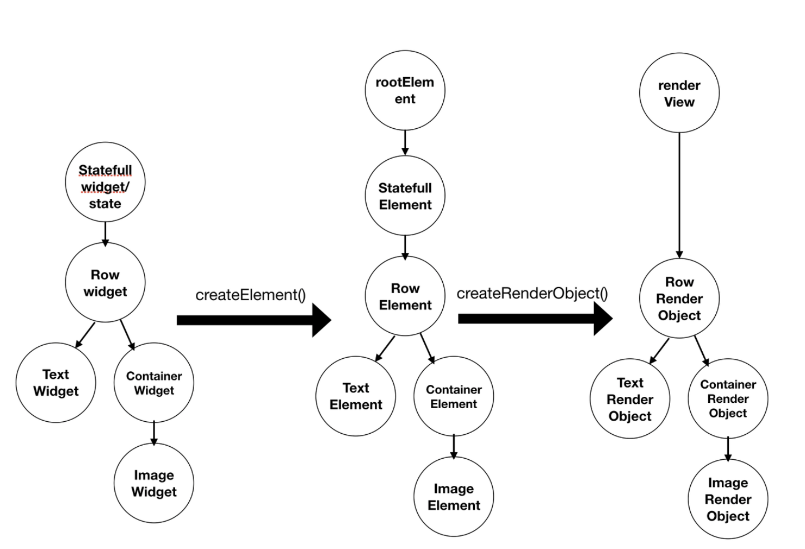

## 플러터 위젯 구조

플러터의 위젯이란 뭔가? 그냥 화면에 그려지는 모든 요소들을 말한다.
플러터는 화면을 그리기 위한 크로스 플랫폼 프레임워크다.
그렇다는 것은? 플러터의 모든 것은 위젯으로 이루어진다는 거다.

컴포넌트라는 말이 입에 좀 더 붙긴 하지만 아무튼 우리는 플러터를 배우는 중이니까 위젯이라고 통일해보자.

플러터 위젯에는 stateful과 stateless 위젯이 있다. 꽤나 직관적이다. 세상에는 변하는 것과 변하지 않는 것이 있고 이것도 그러한 구분일 뿐이다. OOP의 객체라고 이해하면 좀 더 이해하기 쉬울듯.

stateless 위젯에는 텍스트, 이미지, 컨테이너, 로우, 컬럼, 리스트 뷰가 있다. 텍스트는 변할 일이 없고 이미지도 변할 일이 없으니까 당연하다.

stateful 위젯에는 텍스트버튼, 아이콘버튼, 체크박스, 라디오, 텍스트 폼 필드, 드롭다운 버튼이 있다. 뭔가 인터랙션이 필요한 것들이다. 구체적으로는 누르고 드래그하고 등등의 이벤트를 처리해야 하는 것들.

플러터의 모든 것은 위젯으로 이루어져 있다고 했다. 그리고 플러터는 이 위젯들의 트리 계층 구조로 이루어진다. 부모 - 자식 관계를 가진다는 거다. 어라 이거 어디서 많이 들은 내용이다. 브라우저랑 상당히 비슷하지 않나?

브라우저에서도 UI를 렌더링하기 위해서 HTML을 파싱하여 DOM 트리를 만들고, CSS를 읽어서 CSSOM을 만들고, DOM과 CSSOM을 합체해서 Render 트리를 만든다. 이 렌더 트리를 기반으로 실제 픽셀을 프린트하게 된다 (즉 화면을 그린다).

대충 이런 느낌이다. 그러면 플러터는 어떨까?

 [출처](https://brunch.co.kr/@myner/5)

위젯 트리는 신택스 레벨에서 존재한다. 그러니까 개발을 할 때는 플러터라는 게 트리 계층 구조를 가진 위젯들 모음이구나! 라고 이해하게 된다.

플러터 코드를 작성하고 플러터 앱을 실행하면 이 위젯 트리가 다시 엘리먼트 트리가 되고, 엘리먼트 트리는 렌더 트리가 된다.

이 과정을 거치면서 "화면에 어떻게 그릴지"를 결정하게 된다. 생각해봐라. 우리가 다트로 코드를 적을 때 아 내가 쓰고 있는 S24 울트라의 x=10000, y=20000 위치에 파란색 픽셀을 그려줘 라고 요청하는가? 아니다. "픽셀을 화면에 뿌리는" 과정은 렌더링 프로세스의 맨 마지막에 발생한다. 이건 로우한 레벨이라서 (애초에 H/W 작업이다...) 플러터도 직접 수행하지 않고 GPU한테 이거 좀 해달라고 토스해준다.

플러터는 화면을 이렇게 렌더링한다.

1. 레이아웃 -> 렌더링 객체가 자신의 크기와 위치를 결정한다. 이를 결정하려면 부모-자식 관계, 제약조건 전파 어쩌구 이런 내용을 알아야 하는데 대충 이런게 있겠거니 하자. 플러터 1일차에게는 너무 가혹한 일이다.
2. 페인팅 -> 모든 결정이 완료되면 실제로 화면을 그린다. 역시 어떻게 그리는가는 신경쓰지 말자. 그린다는 것은 GPU에게 화면에 픽셀을 뿌려달라고 요청하는 것이다. 플러터는 `Window.render()` 메서드를 쓴다고 한다.

나머지 단계는 굳이 알 필요는 없을 것 같다.

사실 이번 주차 자료에서 플러터가 위젯들의 트리 구조라는 내용을 접하고 DOM 트리가 먼저 생각났다. 브라우저의 렌더링 방식과 비슷할까 싶어서 알아봤는데 역시나 예상은 틀리지 않았다.

### 레퍼런스

- https://velog.io/@error/Flutter-2.-%ED%94%8C%EB%9F%AC%ED%84%B0%EC%9D%98-%EB%A0%8C%EB%8D%94%EB%A7%81
- https://brunch.co.kr/@myner/5
